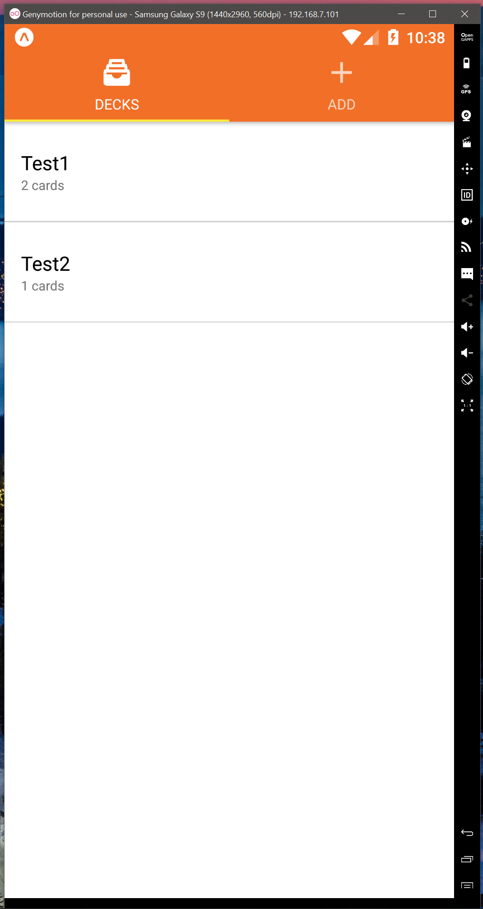
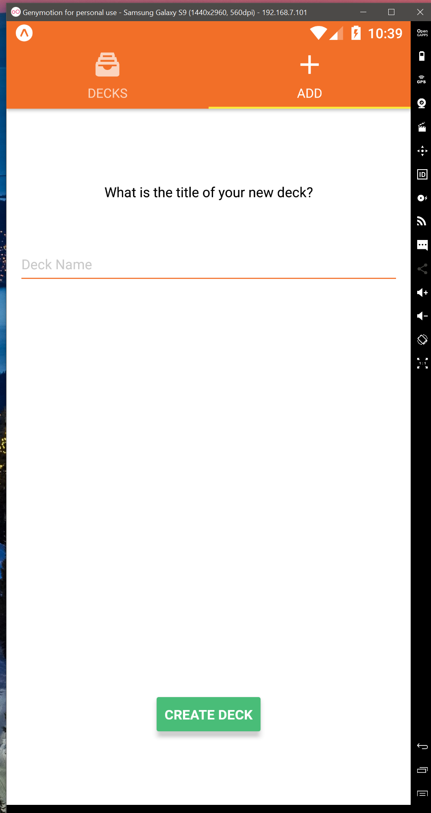
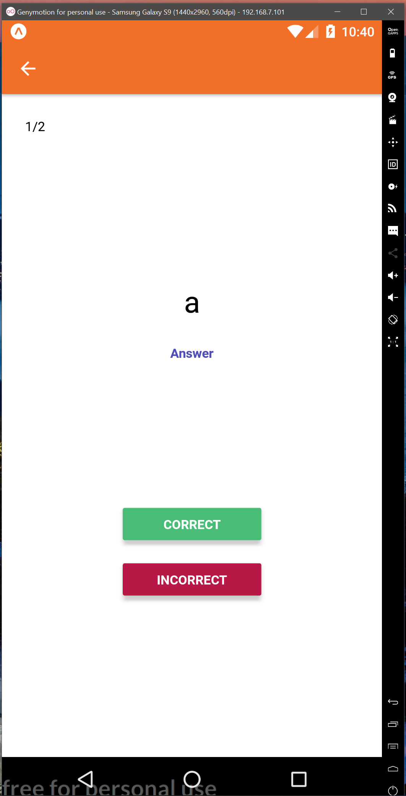
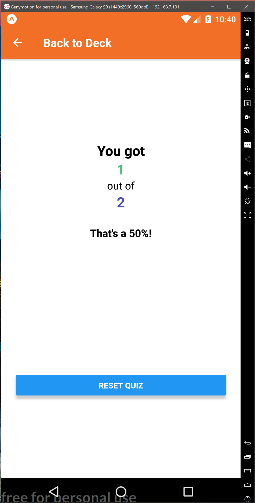

# Mobile Flashcards Project

This is the final project of the Udacity React Nanodegree program. The purpose of this app was to demonstrate usage of React Native and relevant components, namely Expo. Instead of the Android Studio simulator, I elected to use Genymotion, which I found to have a simpler and more straightforward interface.

## FAQs

**Why does the app not persist my flash cards after creating them?**

This application was more oriented as a self-development project and for my project portfolio. Simply put, I elected to use Redux and forgo AsyncStorage as I find AsyncStorage (and LocalStorage) very trivial compared to Redux. I wanted to make sure to fortify my basic Redux and React-Redux knowledge. Although both could technically have been used for this project together, the best strategy in my opinion would be to use AsyncStorage alone given the simplicity of the app and the application state consisting purely of deck and card metadata. Therefore, I preferred to have a clean Redux implementation instead of a dirtier workaround for a problem that would not exist in the real world.

**Does this work with an Apple iPhone?**

Sadly, no. This project is built for Android-only. I do not own any Apple hardware that would have allowed me to test the app on an Apple device.

## Important dependencies

**Android Emulator or Android Device**

Please have an Android emulator or device ready

**Expo**

The device must have Expo installed

## How To Use

* install all project dependencies with `yarn install`
* start the development server with `yarn start`
* Once the app is started, press 'a' (if using expo-cli) to load the app on an android emulator or scan the QR code with your device

## Screenshots

